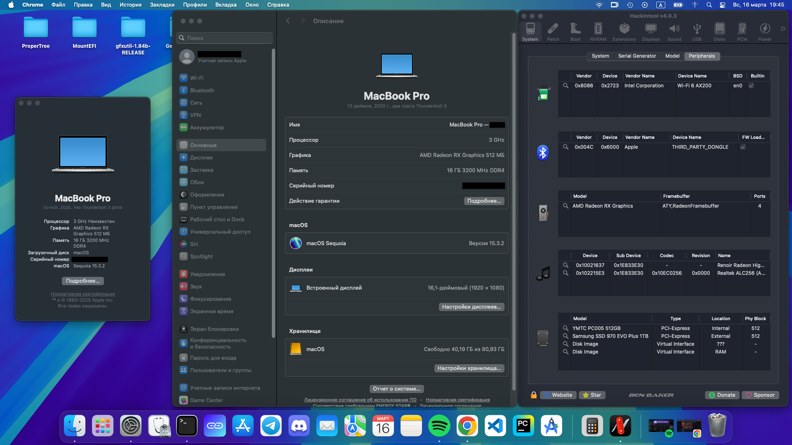
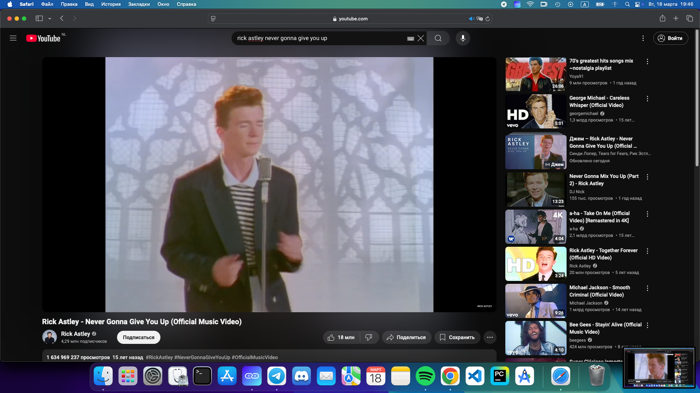
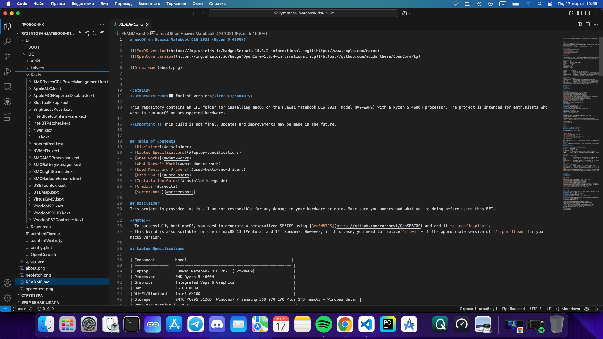
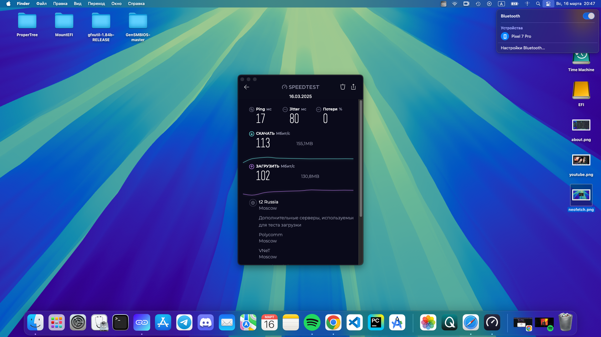
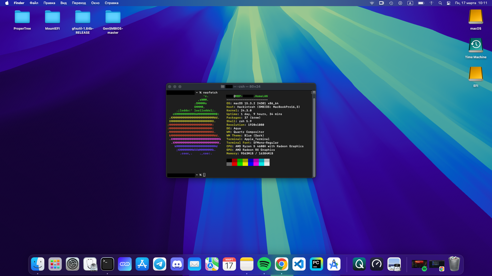

# macOS on Huawei Matebook D16 2021 (Ryzen 5 4600H)

---

<strong>📖 English version</strong>

  
This repository contains an EFI folder for installing macOS on the Huawei Matebook D16 2021 (model HVY-WAP9) with a Ryzen 5 4600H processor. The project is intended for enthusiasts who want to run macOS on unsupported hardware.

**Important:** This build is not final. Updates and improvements may be made in the future.

## Table of Contents
- [Disclaimer](#disclaimer)
- [Laptop Specifications](#laptop-specifications)
- [What Works](#what-works)
- [What Doesn't Work](#what-doesnt-work)
- [Used Kexts and Drivers](#used-kexts-and-drivers)
- [Used SSDTs](#used-ssdts)
- [Installation Guide](#installation-guide)
- [Credits](#credits)
- [Screenshots](#screenshots)

## Disclaimer
This project is provided "as is". I am not responsible for any damage to your hardware or data. Make sure you understand what you're doing before using this EFI.

**Note:**
- To successfully boot macOS, you need to generate a personalized SMBIOS using [GenSMBIOS](https://github.com/corpnewt/GenSMBIOS) and add it to `config.plist`.
- This build is also suitable for use on macOS 13 (Ventura) and 14 (Sonoma). However, in this case, you need to replace `itlwm` with the appropriate version of `AirportItlwm` for your macOS version.

## Laptop Specifications

| Component       | Model                                              |
| --------------- | --------------------------------------------------- |
| Laptop          | Huawei Matebook D16 2021 (HVY-WAP9)                 |
| Processor       | AMD Ryzen 5 4600H                                   |
| Graphics        | Integrated Vega 6 Graphics                          |
| RAM             | 16 GB DDR4                                          |
| Wi-Fi/Bluetooth | Intel AX200                                         |
| Storage         | YMTC PC005 512GB (Windows) / Samsung SSD 970 EVO Plus 1TB (macOS + Windows data) |
| OpenCore Version | 1.0.4                                               |
| SMBIOS          | MacBookPro16,3 (use [GenSMBIOS](https://github.com/corpnewt/GenSMBIOS) to generate) |
| macOS Version   | Sequoia 15.3.2                                      |

## What Works

| Component          | Status | Notes |
| ------------------ | ------ | ----- |
| macOS Boot         | ✅     | The system boots stably without critical errors. |
| Audio              | ✅     | Via AppleALC (built-in speakers, headphone jack, and built-in microphone). HDMI audio works, but volume control is unavailable. |
| USB Ports          | ✅     | All USB ports work correctly thanks to USBToolBox and UTBMap. |
| Wi-Fi              | ✅     | Via itlwm. Wi-Fi works stably but requires [HeliPort](https://github.com/OpenIntelWireless/HeliPort) for connection management (on macOS 15). |
| Bluetooth          | ✅     | Via IntelBluetoothFirmware and BlueToolFixup. Bluetooth works, including device pairing and data transfer. |
| Trackpad and Keyboard | ✅     | Via VoodooI2C and VoodooPS2. The trackpad and keyboard work without issues, including multitouch gestures. |
| Battery            | ✅     | Via SMCBatteryManager. Battery level is displayed correctly. |
| Sleep Mode         | ✅     | Sleep mode works stably; the system sleeps and wakes correctly. |

## What Doesn't Work

| Component          | Status | Notes |
| ------------------ | ------ | ----- |
| Some iServices     | ❌     | FaceTime, iMessage, and some other services do not work due to activation issues. You can try fixing this by following [this guide](https://dortania.github.io/OpenCore-Post-Install/universal/iservices.html). |
| Some FN Keys       | ❌     | Function keys on F7-F12 do not work (e.g., Wi-Fi module toggle, PrintScreen, etc.). This may be related to the macOS keyboard layout. |
| Hardware Acceleration | ❓     | Applications requiring hardware acceleration may crash or behave incorrectly. This can be fixed by increasing VRAM to 1GB+ using [Smokeless UMAF AMD Tool](https://github.com/DavidS95/Smokeless_UMAF). **Warning:** I have not tested increasing VRAM, and all actions related to this are at your own risk. An alternative solution is to disable hardware acceleration in applications where possible (e.g., Google Chrome, Spotify, Discord). |
| Ambient Light Sensor | ❓     | The SMCLightSensor kext is present, but the laptop lacks a physical sensor. Functionality is questionable. |

## Used Kexts and Drivers

### Drivers:
- **HfsPlus.efi**  
- **OpenCanopy.efi**  
- **OpenRuntime.efi**  
- **ResetNvramEntry.efi**  

### Kexts:
| Kext | Description |
| ---- | ----------- |
| [Lilu](https://github.com/acidanthera/Lilu) | Platform for kext patching |
| [NootedRed](https://github.com/NootInc/NootedRed) | Support for AMD integrated graphics |
| [VirtualSMC](https://github.com/acidanthera/VirtualSMC) | SMC emulation |
| [AppleALC](https://github.com/acidanthera/AppleALC) | Audio support |
| [VoodooI2C](https://github.com/VoodooI2C/VoodooI2C) | Trackpad support |
| [VoodooPS2](https://github.com/acidanthera/VoodooPS2) | Keyboard support |
| [itlwm](https://github.com/OpenIntelWireless/itlwm) | Wi-Fi support |
| [IntelBluetoothFirmware](https://github.com/OpenIntelWireless/IntelBluetoothFirmware) | Bluetooth support |
| [BlueToolFixup](https://github.com/acidanthera/BrcmPatchRAM) | Bluetooth fixes |
| [AMDRyzenCPUPowerManagement](https://github.com/trulyspinach/SMCAMDProcessor) | CPU power management |
| [SMCAMDProcessor](https://github.com/trulyspinach/SMCAMDProcessor) | CPU monitoring |
| [NVMeFix](https://github.com/acidanthera/NVMeFix) | NVMe fixes |
| [USBToolBox](https://github.com/USBToolBox/kext) | USB mapping utility |
| [UTBMap](https://github.com/USBToolBox/tool) | USB port map |

## Used SSDTs
Created using [SSDTTime](https://github.com/corpnewt/SSDTTime).

| SSDT | Description |
| ---- | ----------- |
| **SSDT-ALS0** | Adds a fake ambient light sensor (not used as the laptop lacks a physical sensor). |
| **SSDT-EC** | Adds a fake Embedded Controller for macOS. |
| **SSDT-HPET** | Fixes the HPET timer for macOS. |
| **SSDT-PLUG-ALT** | Fixes CPU definitions for AMD. |
| **SSDT-PNLF** | Adds support for backlight control. |
| **SSDT-USBX** | Enables USB power management. |
| **SSDT-XOSI** | Emulates Windows for compatibility with certain ACPI features. |

## Installation Guide
1. Download the EFI from this repository.  
2. Prepare a USB drive with macOS (use the [OpenCore Install Guide](https://dortania.github.io/OpenCore-Install-Guide/)).  
3. Replace the default EFI folder on your USB drive.  
4. Boot from the USB drive and install macOS.  
5. After installation, copy the EFI to the internal SSD.  

## Credits
- [Dortania](https://dortania.github.io/OpenCore-Install-Guide/) for the detailed guide.    
- [NootedRed](https://github.com/NootInc/NootedRed) for AMD integrated graphics support.
- [OpenIntelWireless](https://github.com/OpenIntelWireless) for Wi-Fi and Bluetooth support.
- Developers of kexts and Hackintosh tools.
### Special Thanks
- Members of the [4pda forum](https://4pda.to/forum/index.php?showtopic=84979) for discussions and assistance.  
- The [r/hackintosh](https://www.reddit.com/r/hackintosh/) community on Reddit for support and advice.  
- Authors of the repositories [milovanpms/ryzentosh-matebook16](https://github.com/milovanpms/ryzentosh-matebook16) and [833M0L3/Legion-4600H-Hackintosh](https://github.com/833M0L3/Legion-4600H-Hackintosh) for inspiration and README.md examples.  

## Screenshots 

---

<strong>📖 Русская версия</strong>

# macOS на Huawei Matebook D16 2021 (Ryzen 5 4600H)

Этот репозиторий содержит EFI папку для установки macOS на ноутбук Huawei Matebook D16 2021 (модель HVY-WAP9) с процессором Ryzen 5 4600H. Проект предназначен для энтузиастов, которые хотят запустить macOS на неподдерживаемом оборудовании.

**Важно:** Эта сборка не является финальной. В будущем возможны обновления и доработки.

## Оглавление
- [Дисклеймер](#дисклеймер)
- [Характеристики ноутбука](#характеристики-ноутбука)
- [Что работает](#что-работает)
- [Что не работает](#что-не-работает)
- [Используемые Kexts и драйверы](#используемые-kexts-и-драйверы)
- [Используемые SSDT](#используемые-ssdt)
- [Инструкция по установке](#инструкция-по-установке)
- [Благодарности](#благодарности)
- [Скриншоты](#скриншоты)

## Дисклеймер
Этот проект предоставляется "как есть". Я не несу ответственности за любые повреждения вашего оборудования или данных. Убедитесь, что вы понимаете, что делаете, перед использованием этого EFI.

**Внимание:**
- Для успешной загрузки macOS необходимо сгенерировать персонализированный SMBIOS с помощью [GenSMBIOS](https://github.com/corpnewt/GenSMBIOS) и добавить его в `config.plist`.
- Эта сборка также подходит для использования на macOS 13 (Ventura) и 14 (Sonoma). Однако в этом случае необходимо заменить `itlwm` на соответствующую версию `AirportItlwm` для вашей версии macOS.

## Характеристики ноутбука

| Компонент       | Модель                                              |
| --------------- | --------------------------------------------------- |
| Ноутбук         | Huawei Matebook D16 2021 (HVY-WAP9)                 |
| Процессор       | AMD Ryzen 5 4600H                                   |
| Графика         | Встроенная графика Vega 6                           |
| Оперативная память | 16 ГБ DDR4                                       |
| Wi-Fi/Bluetooth | Intel AX200                                         |
| Хранилище       | YMTC PC005 512GB (Windows) / Samsung SSD 970 EVO Plus 1TB (macOS + Windows data) |
| Версия OpenCore | 1.0.4                                               |
| SMBIOS          | MacBookPro16,3 (используйте [GenSMBIOS](https://github.com/corpnewt/GenSMBIOS) для генерации) |
| Версия macOS    | Sequoia 15.3.2                                      |

## Что работает

| Компонент          | Статус | Примечания |
| ------------------ | ------ | ---------- |
| Загрузка macOS     | ✅     | Система загружается стабильно, без критических ошибок. |
| Звук               | ✅     | Через AppleALC (встроенные динамики, разъём для наушников и встроенный микрофон). Звук через HDMI работает, но отсутствует возможность регулировать уровень громкости. |
| USB-порты          | ✅     | Все USB-порты работают корректно благодаря USBToolBox и UTBMap. |
| Wi-Fi              | ✅     | Через itlwm. Wi-Fi работает стабильно, но требует использования [HeliPort](https://github.com/OpenIntelWireless/HeliPort) для управления подключениями (на macOS 15). |
| Bluetooth          | ✅     | Через IntelBluetoothFirmware и BlueToolFixup. Bluetooth работает, включая подключение устройств и передачу данных. |
| Тачпад и клавиатура | ✅     | Через VoodooI2C и VoodooPS2. Тачпад и клавиатура работают без проблем, включая мультитач-жесты. |
| Батарея            | ✅     | Через SMCBatteryManager. Уровень заряда батареи отображается корректно. |
| Режим сна          | ✅     | Режим сна работает стабильно, система корректно засыпает и пробуждается. |

## Что не работает

| Компонент          | Статус | Примечания |
| ------------------ | ------ | ---------- |
| Некоторые iServices | ❌     | FaceTime, iMessage и некоторые другие сервисы не работают из-за проблем с активацией. Вы можете попробовать исправить это следуя [этому гайду](https://dortania.github.io/OpenCore-Post-Install/universal/iservices.html). |
| Некоторые FN-клавиши | ❌     | Функциональные клавиши на F7-F12 не работают (не переключается модуль Wi-Fi, не работает PrintScreen и т.д.) Возможно, это связано с раскладкой клавиатуры в macOS.         |
| Аппаратное ускорение | ❓     | Приложения, требующие аппаратного ускорения, могут вылетать и работать некорректно. Это можно исправить, увеличив объём VRAM до 1 ГБ+ с помощью [Smokeless UMAF AMD Tool](https://github.com/DavidS95/Smokeless_UMAF). **Внимание:** Я не тестировал увеличение объёма VRAM, и все действия, связанные с этим, выполняются на ваш страх и риск. Альтернативным решением является отключение аппаратного ускорения в приложениях, где это возможно (например, Google Chrome, Spotify, Discord). |
| Датчик освещённости | ❓     | Кекст SMCLightSensor присутствует, но в ноутбуке нет физического датчика. Работоспособность под вопросом. |

## Используемые Kext'ы и драйверы

### Драйверы:
- **HfsPlus.efi**  
- **OpenCanopy.efi**  
- **OpenRuntime.efi**  
- **ResetNvramEntry.efi**  

### Kexts:
| Kext | Описание |
| ---- | -------- |
| [Lilu](https://github.com/acidanthera/Lilu) | Платформа для патчинга kext'ов |
| [NootedRed](https://github.com/NootInc/NootedRed) | Поддержка встроенной графики AMD |
| [VirtualSMC](https://github.com/acidanthera/VirtualSMC) | Эмуляция SMC |
| [AppleALC](https://github.com/acidanthera/AppleALC) | Поддержка звука |
| [VoodooI2C](https://github.com/VoodooI2C/VoodooI2C) | Поддержка тачпада |
| [VoodooPS2](https://github.com/acidanthera/VoodooPS2) | Поддержка клавиатуры |
| [itlwm](https://github.com/OpenIntelWireless/itlwm) | Поддержка Wi-Fi |
| [IntelBluetoothFirmware](https://github.com/OpenIntelWireless/IntelBluetoothFirmware) | Поддержка Bluetooth |
| [BlueToolFixup](https://github.com/acidanthera/BrcmPatchRAM) | Исправление Bluetooth |
| [AMDRyzenCPUPowerManagement](https://github.com/trulyspinach/SMCAMDProcessor) | Управление питанием процессора |
| [SMCAMDProcessor](https://github.com/trulyspinach/SMCAMDProcessor) | Мониторинг процессора |
| [NVMeFix](https://github.com/acidanthera/NVMeFix) | Исправление NVMe |
| [USBToolBox](https://github.com/USBToolBox/kext) | Утилита для маппинга USB |
| [UTBMap](https://github.com/USBToolBox/tool) | Карта USB-портов |

## Используемые SSDT
Для создания SSDT использовался инструмент [SSDTTime](https://github.com/corpnewt/SSDTTime).

| SSDT | Описание |
| ---- | -------- |
| **SSDT-ALS0** | Добавляет фейковый датчик освещённости (не используется, так как в ноутбуке нет физического датчика). |
| **SSDT-EC** | Добавляет фейковый Embedded Controller для macOS. |
| **SSDT-HPET** | Исправляет таймер HPET для macOS. |
| **SSDT-PLUG-ALT** | Исправляет определение процессора для AMD. |
| **SSDT-PNLF** | Добавляет поддержку подсветки экрана. |
| **SSDT-USBX** | Включает управление питанием USB. |
| **SSDT-XOSI** | Эмулирует Windows для совместимости с некоторыми функциями ACPI. |

## Инструкция по установке
1. Скачайте EFI из этого репозитория.  
2. Подготовьте флешку с macOS (используйте [OpenCore Install Guide](https://dortania.github.io/OpenCore-Install-Guide/)).  
3. Замените стандартную папку EFI на вашей флешке.  
4. Загрузитесь с флешки и установите macOS.  
5. После установки скопируйте EFI на внутренний SSD.  

## Благодарности
- [Dortania](https://dortania.github.io/OpenCore-Install-Guide/) за подробный гайд.    
- [NootedRed](https://github.com/NootInc/NootedRed) за поддержку графики AMD.
- [OpenIntelWireless](https://github.com/OpenIntelWireless) за поддержку Wi-Fi и Bluetooth.
- Разработчикам kext'ов и инструментов для Hackintosh.
### Отдельная благодарность
- Участникам форума [4pda](https://4pda.to/forum/index.php?showtopic=84979) за обсуждения и помощь.  
- Сообществу [r/hackintosh](https://www.reddit.com/r/hackintosh/) на Reddit за поддержку и советы.  
- Авторам репозиториев [milovanpms/ryzentosh-matebook16](https://github.com/milovanpms/ryzentosh-matebook16) и [833M0L3/Legion-4600H-Hackintosh](https://github.com/833M0L3/Legion-4600H-Hackintosh) за вдохновение и примеры оформления README.md.  

## Скриншоты 

---
